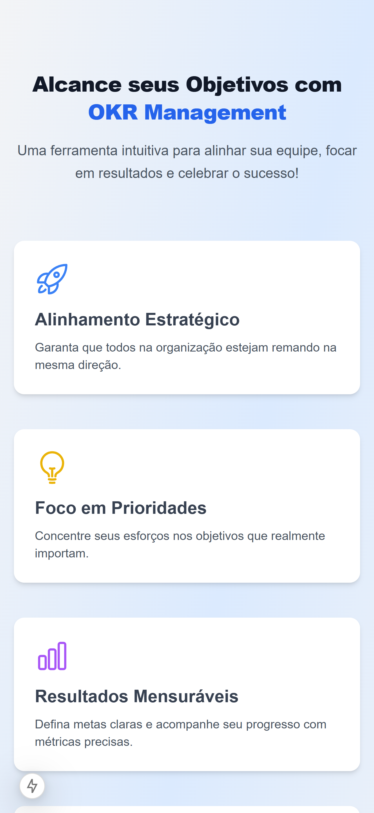
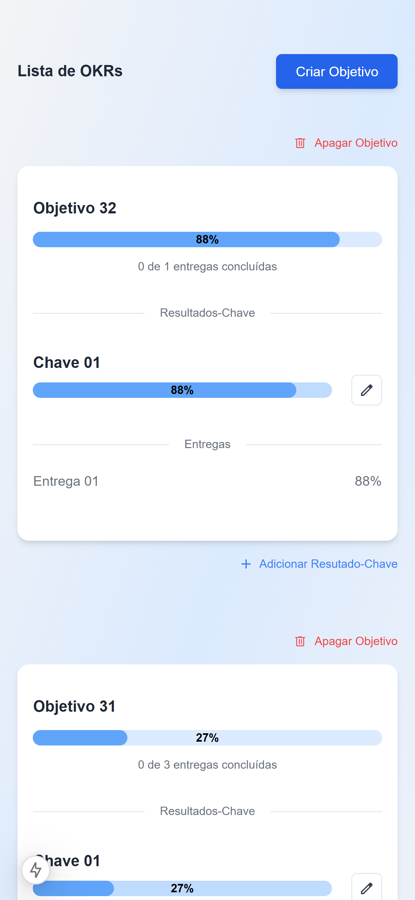
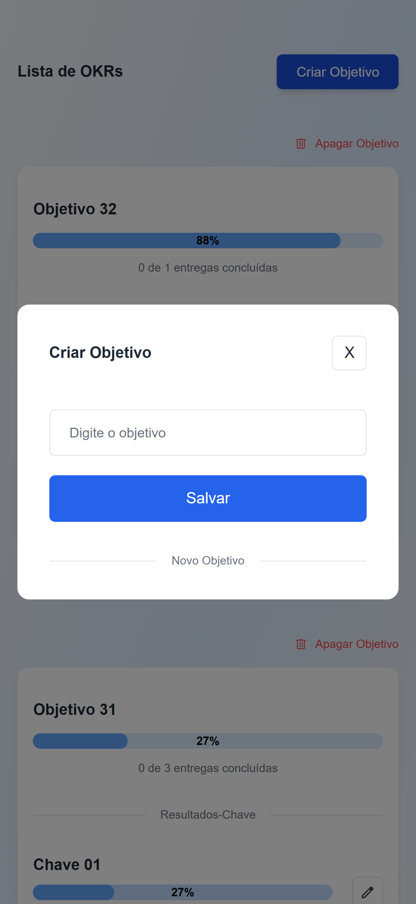
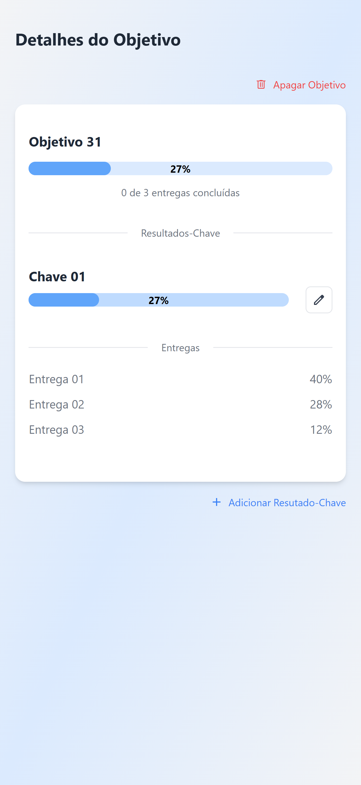
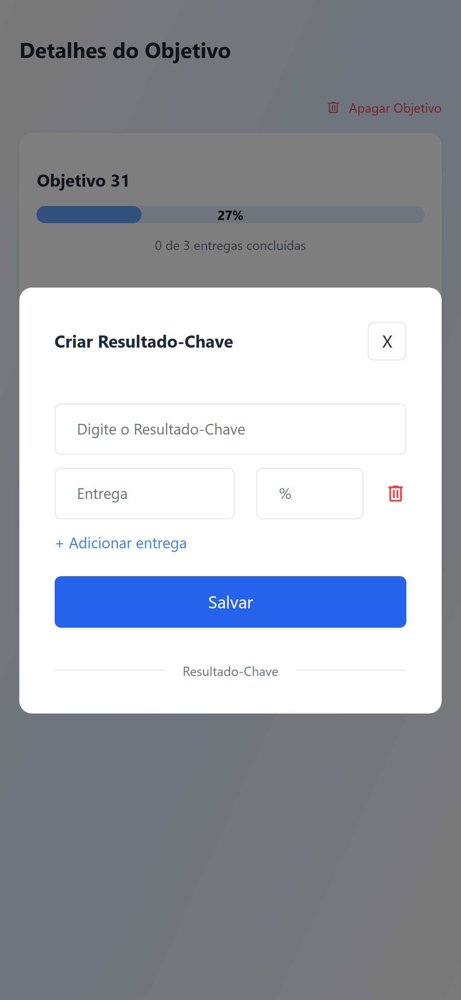
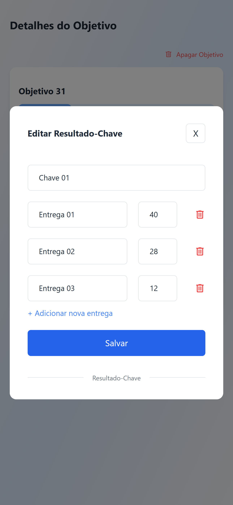

<h1 align="center">OKR Management</h1>

  
  
  
  
   
    

---

## About

This project is a front-end web application for OKR management, and it served as a technical challenge during the selection process for a **Front-End Dev** position. It was built with Next.js and Tailwind CSS.

## Technologies

*   [Next.js](https://nextjs.org/)
*   [TypeScript](https://www.typescriptlang.org/)
*   [Tailwind CSS](https://tailwindcss.com/)
*   [npm](https://www.npmjs.com/)
*   [Axios](https://axios-http.com/ptbr/docs/intro)

## Getting Started

To run this project locally:

1.  Clone the repository:  `git clone <repository_url>`
2.  Navigate to the project directory: `cd <project_name>`
3.  Install dependencies: `npm install`
4.  Start the development server: `npm run dev`

---

Developed by - Renato Souza
